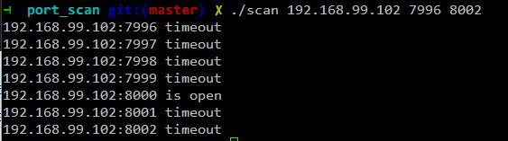

# NetSec-Lab

网络安全实验作业

两天写完，快糙猛，请勿仔细看代码:joy:

## 1. SCANNER简单网络扫描程序实现
用C语言编写一个在linux下扫描局域网内主机的程序。要求可以显示局域网内的主机名列表，IP地址列表，并可以显示哪些主机开放了哪些端口。

> Usage:  
	./scan <host> <start_port> <end_port>  
> 	./scan -d <device name> <start_port> <end_port>  
> For example:  
> 	./scan 127.0.0.1 75 85  
> 	./scan -d eth0 75 85  

没有写 raw socket，所以只能测试 TCP 连接，超时或拒绝连接则视为不开放，所以极端情况下扫描一个端口需要 1s :joy:

## 2. 网络嗅探器
用C语言编写一个监听网络流量的程序，并对截取的报文进行解析。

只对 ARP 报文进行拦截及解析，并没有解析其它的报文。

## 参考文档
* [C program to get ip address from interface name on Linux](http://www.binarytides.com/c-program-to-get-ip-address-from-interface-name-on-linux/)
* [Programming with pacp](http://www.tcpdump.org/pcap.html)
* [地址解析协议](https://zh.wikipedia.org/wiki/地址解析协议)

## License
因为后面还要检查作业/答辩，所以目前保留所有权利。
